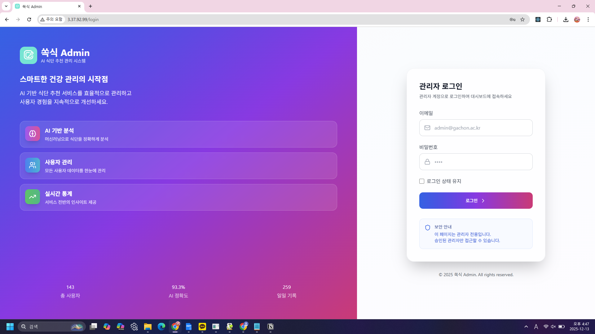
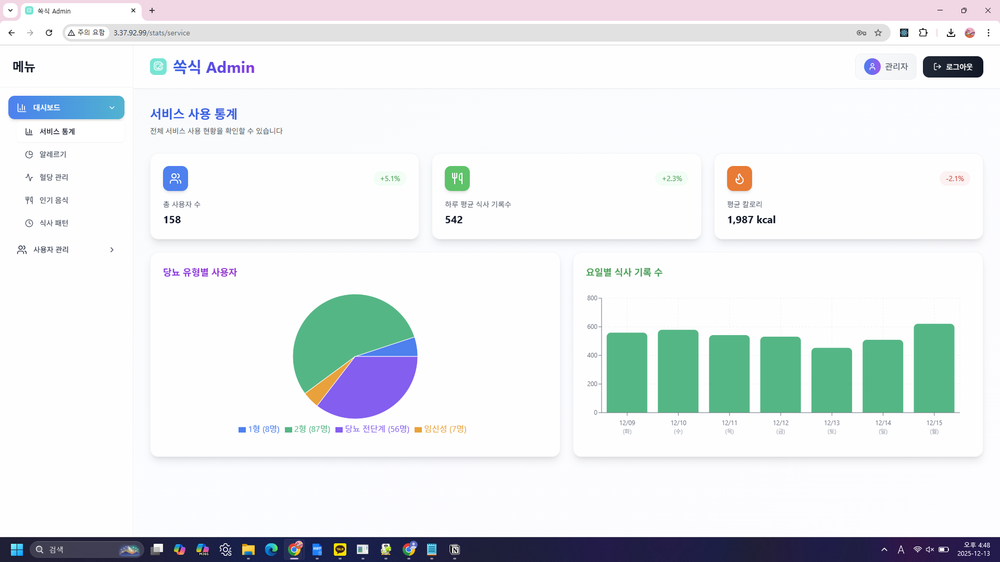
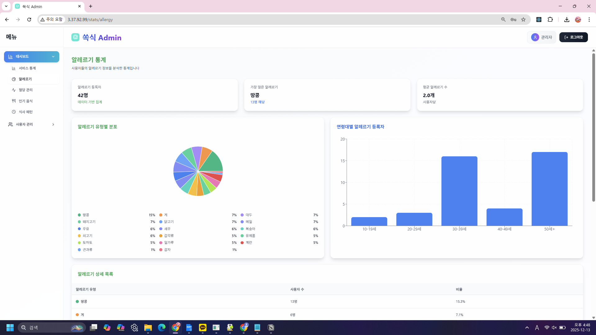
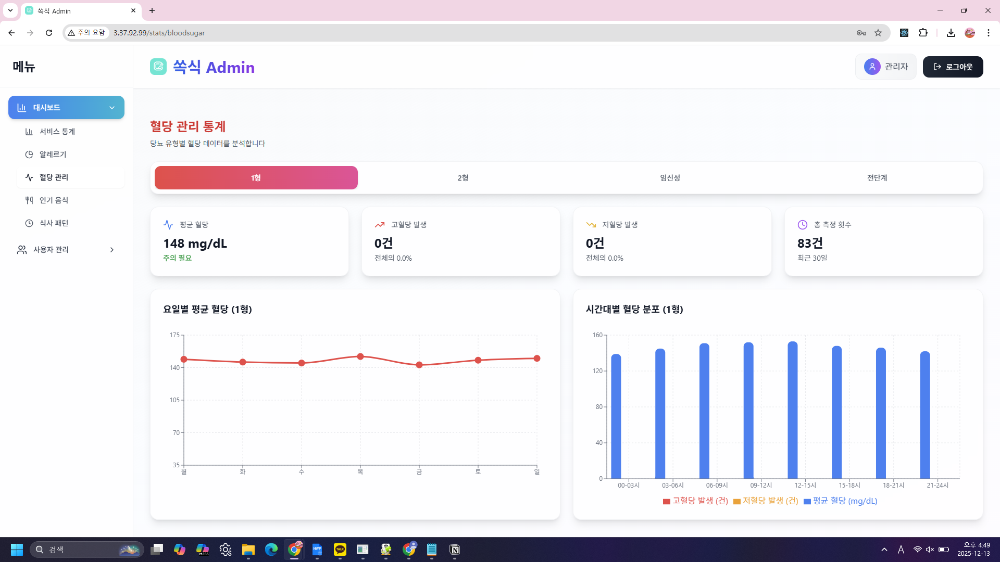
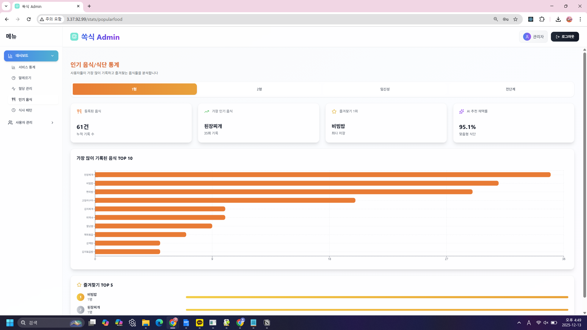
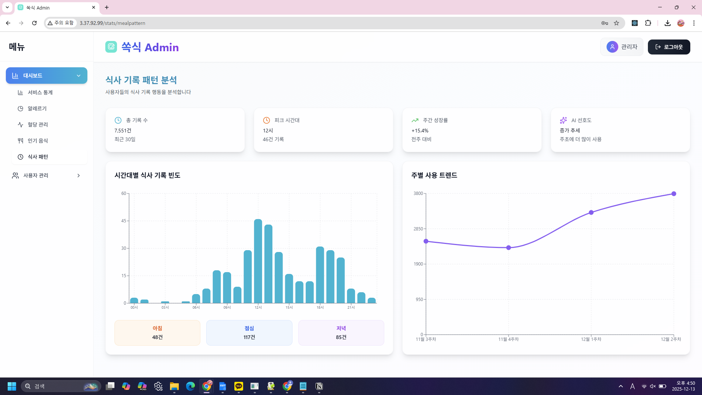
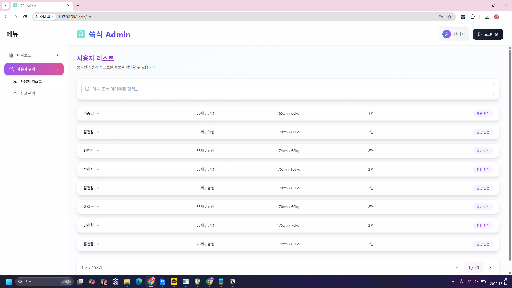
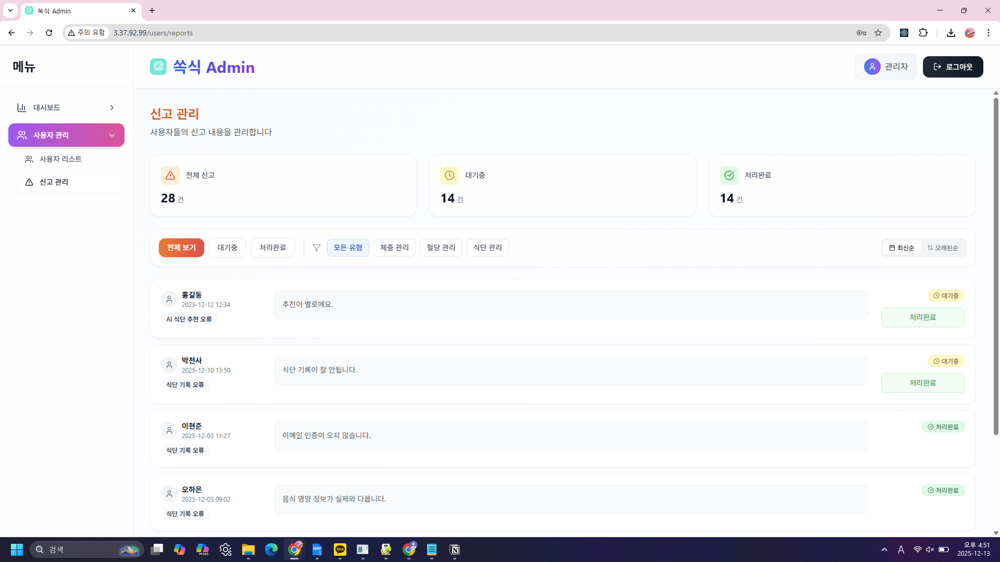

# Sugar Care Admin — 혈당 관리 서비스 관리자 대시보드

> 가천대학교 팀 프로젝트로 진행한 혈당(당뇨) 관리 서비스 '쏙식'의 관리자용 웹 대시보드.
> 사용자의 혈당·식단·알레르기·목표 데이터를 관리자가 한눈에 모니터링하고, 신고 내역을 관리할 수 있는 화면을 구현.
> React 기반 프론트엔드 개발 담당.

이 브랜치(`main`)는 실제 백엔드 서버와 연동되는 원본 코드이며, 팀 프로젝트 종료 후 백엔드 서버가 종료되어 현재는 로컬에서 API 연동 화면을 확인할 수 없음.
`demo` 브랜치는 동일한 화면을 mock 데이터로 재현해 백엔드 없이도 바로 실행해볼 수 있도록 만든 버전.

---

## 스크린샷

















---

## 프로젝트 소개

Android 및 iOS 모바일 환경에서 당뇨 환자 및 고위험군을 위한 AI 기반 식단·혈당 통합 관리 솔루션 '쏙식'의 관리자 대시보드.

주 사용자는 당뇨병 전단계 인구부터 지속적인 식사 요법과 혈당 관리가 필수적인 1·2형 당뇨 및 임신성 당뇨 환자이며, 모바일을 통해 접속·사용하기 편리하도록 설계됨. 환자의 라이프로그(식단, 혈당)를 체계적으로 관리하기 위해 별도의 관리자 기능을 구성했으며, 사용 편의성과 의학적 정보의 신뢰성, 관리의 지속성을 추구할 수 있도록 개발함.

- 팀 구성: 프론트엔드 2명, 백엔드 2명
- 배포 환경: 별도 백엔드 API 서버 연동 (현재 서버 미운영)

---

## 기술 스택

| 분류 | 기술 |
|---|---|
| Frontend | React 19, Vite |
| Styling | Tailwind CSS, PostCSS |
| 데이터 통신 | Axios |
| 데이터 시각화 | Recharts (Line, Bar, Pie Chart) |
| 아이콘 | Lucide React |
| Lint | ESLint |

---

## 담당 역할

이 프로젝트에서 프론트엔드 개발을 담당.

- 관리자 대시보드 전체 레이아웃 및 사이드바 내비게이션 구현 (`Sidebar.jsx`, `Header.jsx`)
- 로그인 화면 UI 및 인증 흐름 구현 (`LoginPage.jsx`)
- Recharts를 활용한 혈당/알레르기/인기 음식/식사 패턴 통계 차트 개발
- Axios로 백엔드 API 연동 및 사용자 리스트/신고 데이터 fetching 처리
- 반응형 레이아웃 구성 (모바일 사이드바 토글 등)

---

## 주요 화면 / 기능

`App.jsx`의 메뉴 구조 기준으로 구현된 화면.

대시보드
- 서비스 통계 (`ServiceStats`) — 일별 식사 기록 수, 이용자 수 등 종합 통계
- 알레르기 통계 (`AllergyStats`)
- 혈당 관리 통계 (`BloodSugarStats`) — 당뇨 유형별 시간대별 혈당 추이
- 인기 음식 통계 (`PopularFoodStats`)
- 식사 패턴 통계 (`MealPatternStats`)

사용자 관리
- 사용자 리스트 (`UserList`) — 검색, 페이지네이션, 상세정보(알레르기/선호음식/목표혈당 등) 조회
- 신고 관리 (`ReportManagement`) — 유형별(체중/혈당/식단) 필터링, 정렬, 처리 상태 관리

---

## 실행 방법

```bash
git clone https://github.com/Lee-Junseung/sugar-care-admin.git
cd sugar-care-admin
npm install
npm run dev
```

> 현재 백엔드 서버가 종료되어 위 방법으로는 데이터가 표시되지 않음. 화면 동작을 확인하려면 [`demo` 브랜치](https://github.com/Lee-Junseung/sugar-care-admin/tree/demo)를 이용.

---

## 설계서 대비 구현 현황 점검

포트폴리오 정리 과정에서 프로젝트 설계서(요구기능 정의서)와 실제 코드를 항목별로 대조함.

| 설계서 요구항목 | 구현 상태 |
|---|---|
| 로그인 / 로그아웃 | 로그아웃 정상 구현. 로그인은 백엔드 인증 없이 프론트엔드에 계정 정보가 하드코딩됨 |
| 서비스통계 - 총사용자수 | API 연동 완료 |
| 서비스통계 - 하루평균식사기록수, 평균칼로리 | 하드코딩 (미구현) |
| 서비스통계 - 요일별 식사기록수 | 하드코딩 (미구현) |
| 알레르기 서비스 전체 | API 연동 완료 |
| 혈당관리 - 평균/고저혈당/요일별 평균 | API 연동 완료 |
| 혈당관리 - 시간대별 혈당분포 | 하드코딩 (미구현) |
| 인기음식 - TOP10 / TOP5 / 등록음식 | API 연동 완료 |
| 인기음식 - AI 추천 채택률 | 하드코딩 (미구현) |
| 식사패턴 서비스 (전체 6개 세부항목) | API 연동 없음, 전체 미구현 |
| 사용자리스트 - 조회 / 검색 | API 연동 완료 (+ 설계서에 없던 페이지네이션 추가 구현) |
| 신고관리 - 조회 / 유형별 필터 / 처리 | API 연동 완료 |
| (설계서에 없음) 목표(Goal) 통계 | 코드는 존재하나 메뉴 미연결로 접근 불가 (아래 참고) |

---

## 회고: 재검토 중 발견한 문제점

포트폴리오 정리를 위해 코드를 다시 살펴보며 아래 문제들을 발견함. 당시엔 인지하지 못했던 부분으로, 실무였다면 QA 단계에서 걸러졌어야 할 이슈들.

**1. UI 상태 관리 버그**
로그인 성공 시 `setCurrentSection('ServiceStats')`로 상태를 세팅하는데, 실제 메뉴 id는 `'stats-service'`(kebab-case). 화면 자체는 `switch`문의 `default` 처리로 정상 노출되지만, 로그인 직후 사이드바의 활성 메뉴 하이라이트가 표시되지 않는 버그가 있음. 상태값 네이밍을 메뉴 id와 일치시켰어야 함.

**2. 설정 파일과 문서의 불일치**
과거 README에는 `.env`의 `VITE_API_URL`을 지정하라고 안내했지만, 실제 코드 어디에도 이 환경변수를 참조하는 곳이 없었음. 백엔드 주소는 `vite.config.js`의 `server.proxy` 설정에 직접 하드코딩되어 있어, `.env`를 수정해도 실제 요청 주소는 바뀌지 않는 구조였음. 또한 이 프록시 방식은 `npm run dev` 개발 서버에서만 동작하며, 프로덕션 빌드 후 배포 시에는 별도의 리버스 프록시 설정 없이는 API 연동이 불가능한 구조였음 — 배포 아키텍처를 고려하지 않은 설정.

**3. API 실패 시 사용자 피드백 부재**
`axios` 요청 실패 시 `console.error`만 기록하고 화면에는 아무 안내가 없음. 그 결과 실제로는 "데이터 로딩 실패"인데 "총 사용자 수 0명"처럼 진짜 0건인 것처럼 표시됨. 관리자 대시보드에서는 데이터 신뢰성과 직결되는 문제.

**4. 인증 로직이 프론트엔드에 하드코딩됨**
`main` 브랜치(실제 서비스 버전)임에도 로그인 이메일/비밀번호 검증이 클라이언트 코드에 직접 박혀 있고, 백엔드 로그인 API를 호출하지 않음. 짧은 개발 기간 안에 별도 인증 API를 구축하지 못해 임시로 처리한 것으로 보임.

**5. 미구현 / 부분구현 API 연동 항목 전체 정리**
로그인 인증 외에도 API 연동이 누락되거나 부분적으로만 이루어진 부분을 전수 조사함 (위 "설계서 대비 구현 현황 점검" 표 참고). 요약하면:
- 완전 미구현: 로그인 인증, 식사 패턴 서비스(`MealPatternStats`) 전체
- 부분 미구현(하드코딩 혼재): 서비스 통계 일부 카드, 혈당관리 시간대별 분포, 인기음식 AI 추천 채택률

**6. 번들 크기 최적화 여지**
`npm run build` 시 단일 JS 청크가 693KB(gzip 207KB)로, Rollup 권장 기준(500KB)을 초과. 8개 화면 컴포넌트를 모두 정적 import하고 있어 첫 로딩 시 전체 코드를 한 번에 내려받는 구조. `React.lazy()` + 동적 `import()`로 화면 단위 코드 스플리팅을 적용하면 개선 가능.

**7. 미사용 컴포넌트 (GoalStats)**
`GoalStats.jsx`는 사용자 건강 목표를 전체 집계 통계(목표별 분포, 달성률, 월별 추이)로 보여주기 위해 만든 컴포넌트이나, `App.jsx`의 라우팅 로직(`case 'stats-goals'`)에는 남아있는 반면 `Sidebar.jsx` 메뉴에는 연결되어 있지 않아 실제 화면에서는 접근이 불가능한 상태.
- 개별 사용자의 건강 목표는 '사용자 리스트' 화면에서 이미 확인 가능 (`user.goal`, 목표 혈당)
- `GoalStats`는 이를 전체 통계로 확장하려던 시도였으나, 목표 "달성/미달성"을 판정할 기준 데이터가 설계서에 별도로 정의되어 있지 않아 구현이 중단된 것으로 추정됨
- 설계서(요구기능 정의서)에도 관리자용 "목표 통계" 기능 자체가 명시되어 있지 않음 — 개발 과정에서 아이디어 차원으로 시도했다가 스코프 아웃된 것으로 보이며, 이후 삭제하지 않고 참고용으로 남겨둠

**개선 반영**
위 문제 중 UI 버그 수정 및 에러 상태 표시 개선은 [`demo` 브랜치](https://github.com/Lee-Junseung/sugar-care-admin/tree/demo)에 반영함. `main` 브랜치는 실제 팀 프로젝트 당시 코드를 그대로 보존하기 위해 별도로 수정하지 않음.