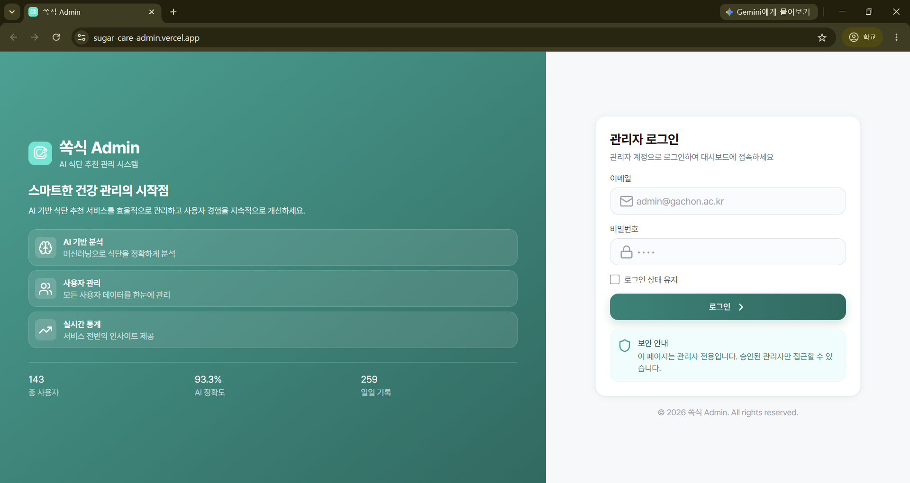
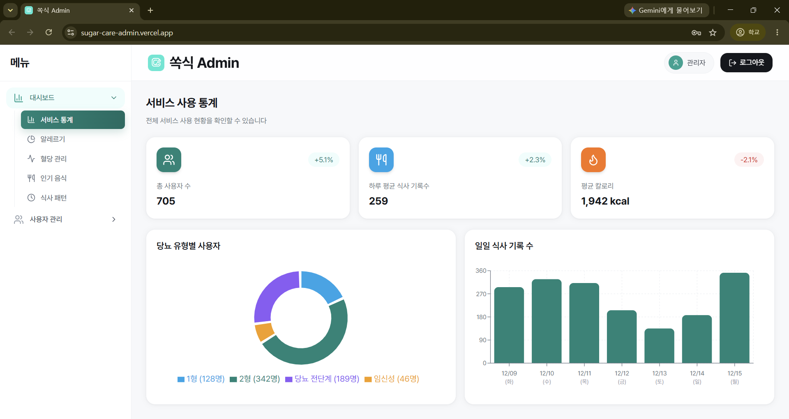
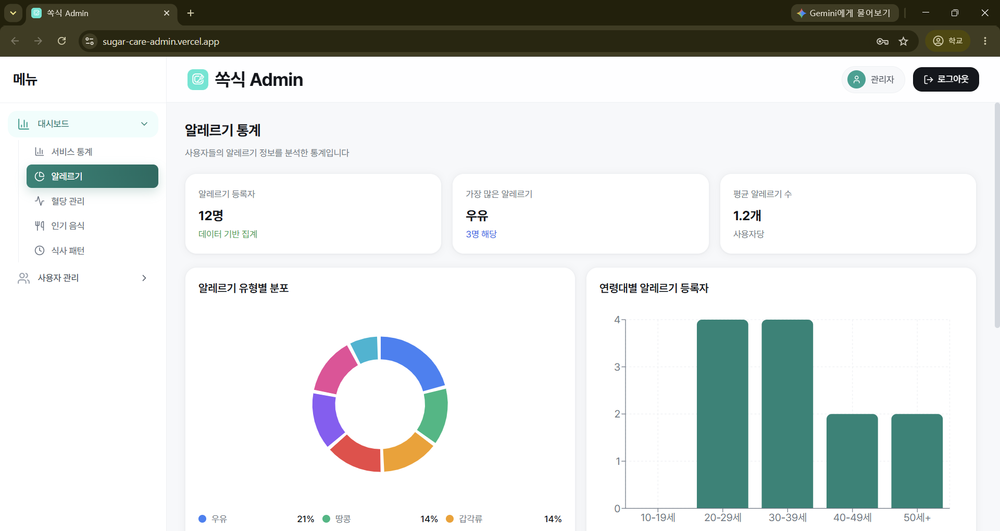
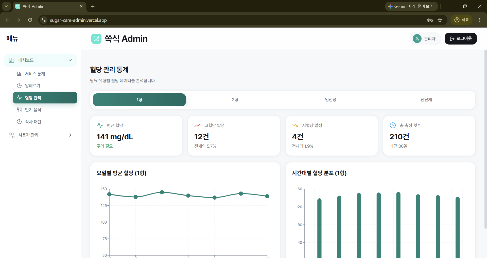
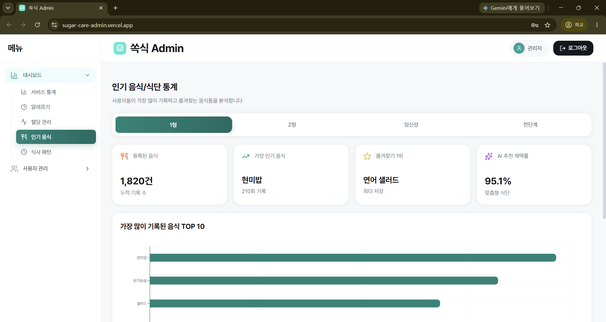
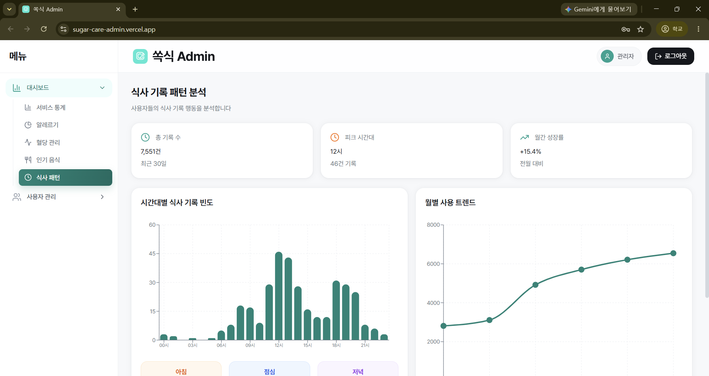
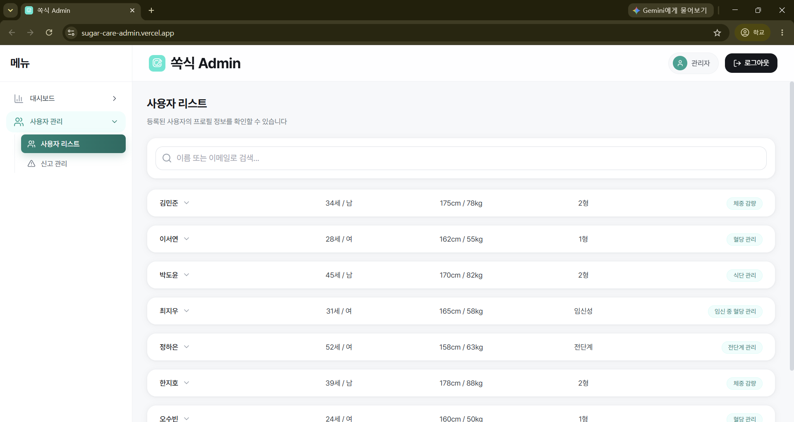
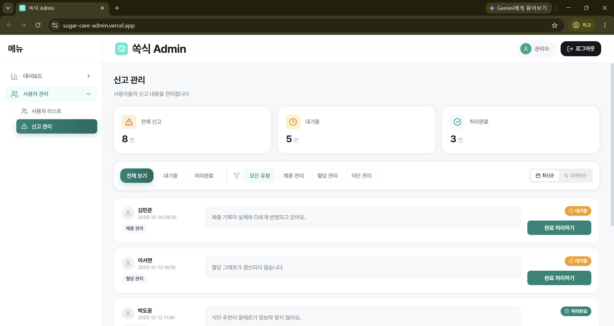

# Sugar Care Admin — demo 브랜치

> 프로젝트 전체 소개, 기획 의도, 설계서 대비 구현 범위 조정, 회고는 [`main` 브랜치의 README](https://github.com/Lee-Junseung/sugar-care-admin)를 참고. 이 문서는 `demo` 브랜치에서 `main`과 달라진 부분만 다룸.

---

## 이 브랜치의 목적

팀 프로젝트 종료와 함께 실제 백엔드 서버가 종료되어, `main` 브랜치의 원본 코드는 로컬에서 실행해도 데이터가 표시되지 않음. 화면 동작과 UI를 백엔드 없이 바로 확인할 수 있도록, 동일한 화면을 **Mock 데이터로 재현**한 버전이 이 `demo` 브랜치임.

---

## `main`과 달라진 부분

### 1. API 연동 → Mock 데이터로 대체
아래 화면들은 원래 Axios로 백엔드 API를 호출했으나, 이 브랜치에서는 동일한 응답 구조를 그대로 흉내 낸 Mock 데이터로 대체함. 화면 구성과 데이터 흐름 로직은 원본과 동일하게 유지.
- 서비스 통계, 알레르기 통계, 혈당 관리 통계, 인기 음식 통계, 사용자 리스트, 신고 관리

(식사 패턴 통계와 로그인 인증은 `main`에서도 원래 하드코딩이었던 부분이라 변경 없음.)

### 2. main README의 회고에서 발견한 문제점 개선
- **UI 상태 관리 버그 수정**: 로그인 성공 시 세팅되는 상태값을 사이드바 메뉴 id와 일치시켜, 사이드바 활성 하이라이트 누락 문제를 해결함
- **API 에러 핸들링 일관성 확보**: 에러 안내가 없던 화면(서비스 통계·알레르기 통계·인기 음식 통계·사용자 리스트·신고 목록 조회)에 공통 에러 표시를 추가해, 실패 상황과 실제 데이터 0건을 구분할 수 있도록 개선함

`main` 브랜치는 실제 팀 프로젝트 당시 코드를 그대로 보존하기 위해 위 개선사항을 반영하지 않음.

---

## 실행 방법

```bash
git clone https://github.com/Lee-Junseung/sugar-care-admin.git
cd sugar-care-admin
git checkout demo

npm install
npm run dev
```

참고: `vite.config.js`에 프론트엔드 포트가 80번으로 고정되어 있어, OS/환경에 따라 관리자 권한이 필요할 수 있음. (Mock 데이터로 전환되며 `main`에 있던 백엔드 프록시 설정은 제거함.)

---

## 스크린샷















