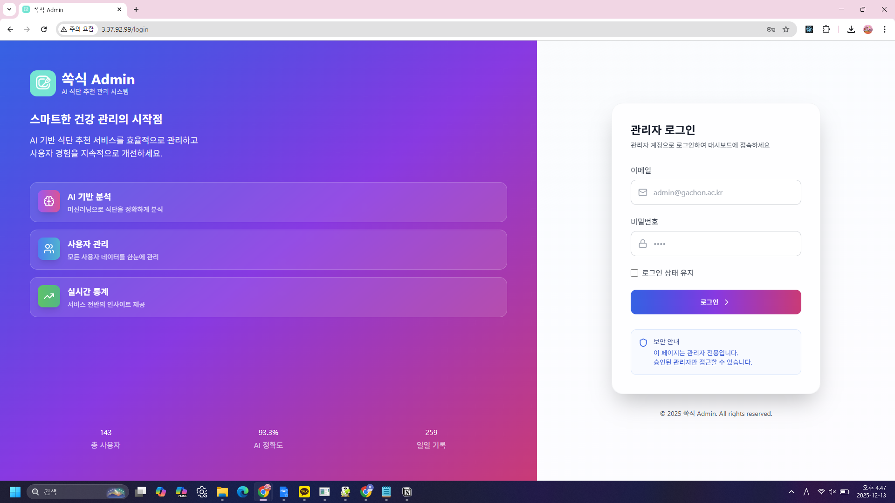
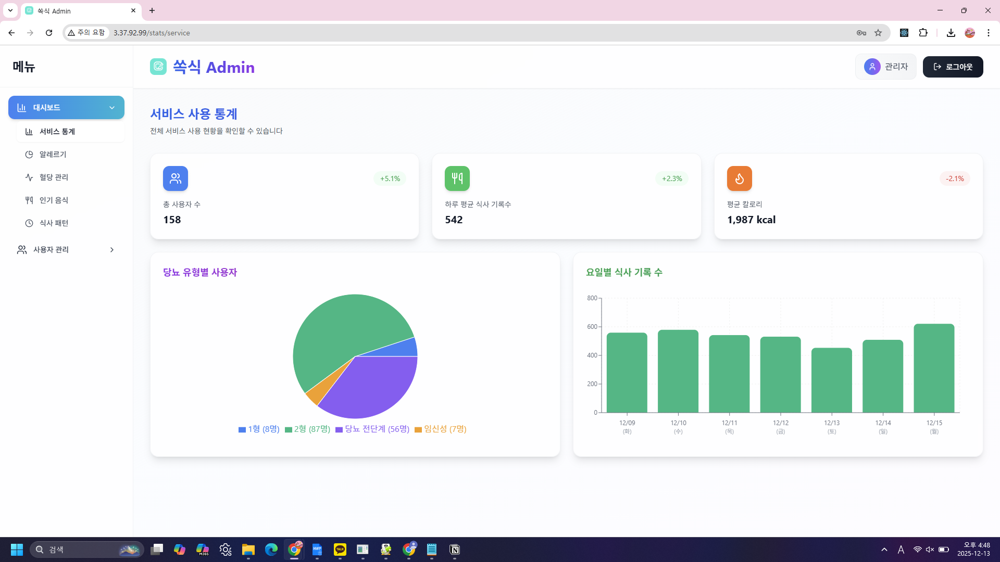
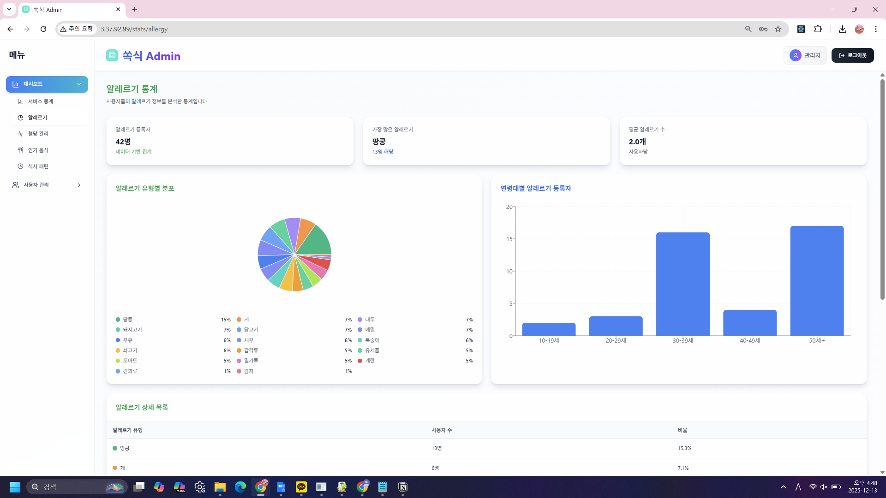
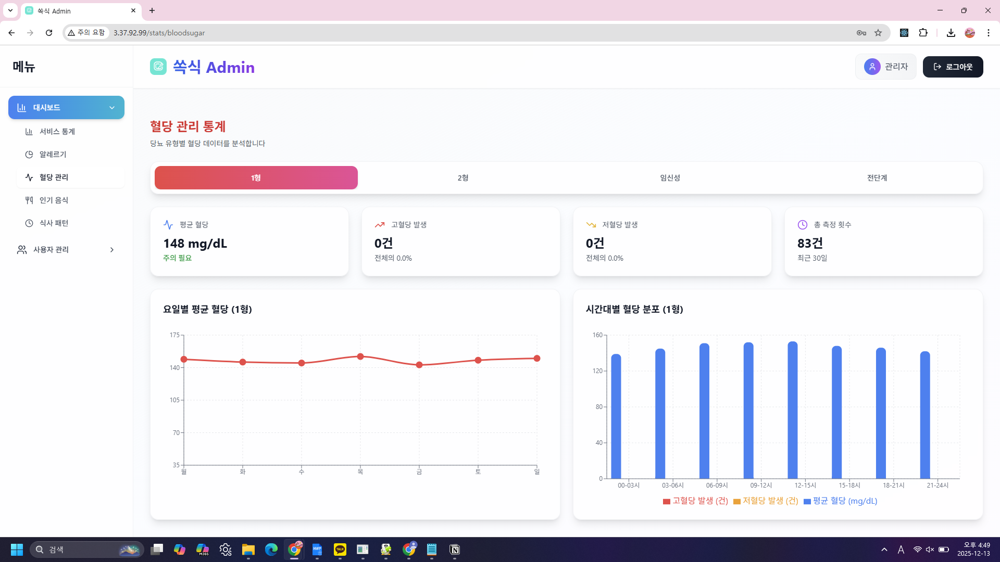
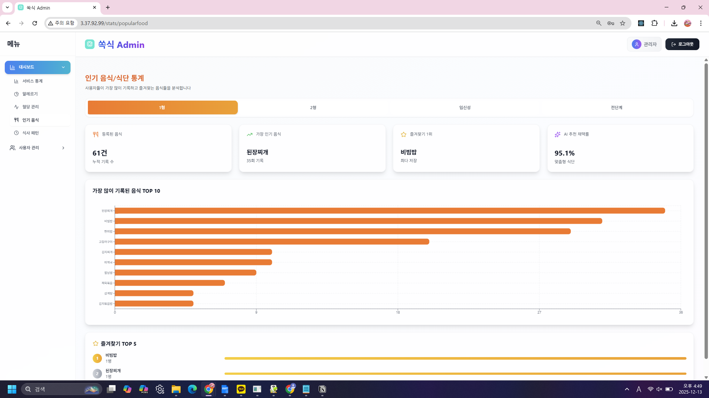
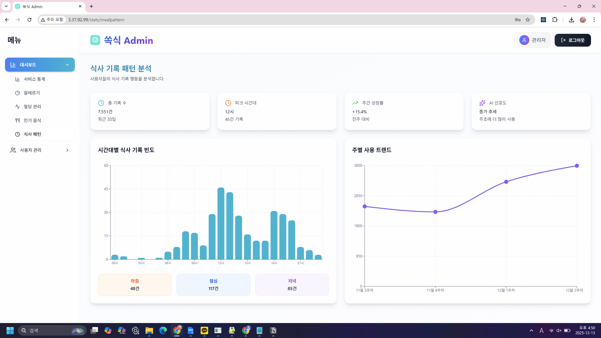
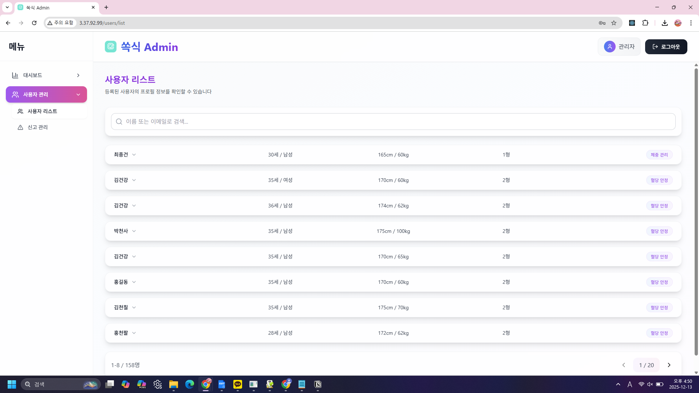
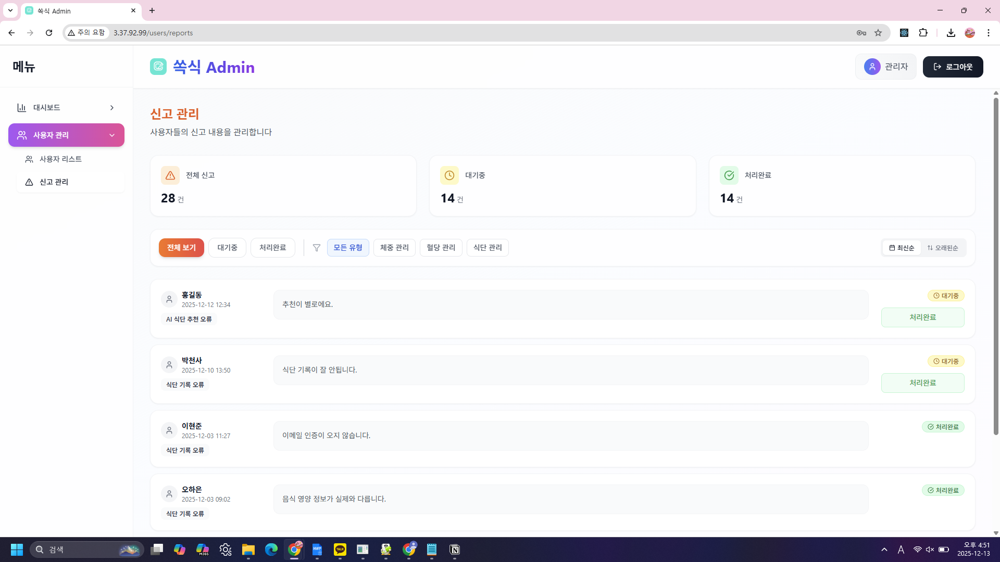

# Sugar Care Admin — 혈당 관리 서비스 관리자 대시보드

> 가천대학교 팀 프로젝트로 진행한 AI 기반 식단·혈당 통합 관리 솔루션 '쏙식'의 관리자용 PC 웹 대시보드.
> 당뇨 환자 및 고위험군의 라이프로그(식단, 혈당, 알레르기)를 관리자가 한눈에 모니터링하고 체계적으로 관리할 수 있도록 구현함.

**포트폴리오 포함 목적**
단순히 완성된 화면을 보여주기보다, 실제 설계 문서 대비 구현 결과가 어떻게 달라졌고 그 과정에서 어떤 판단을 내렸는지 기록하기 위해 작성함. 상세한 의사결정 과정은 하단의 **[설계서 대비 구현 현황 — 기획자 관점에서 본 범위 조정]** 섹션에 담아둠.

---

## 프로젝트 개요

- **팀 구성:** 프론트엔드 2명, 백엔드 2명 (본인: React 기반 프론트엔드 개발 담당)
- **주요 타겟:** '쏙식' 서비스를 운영하는 관리자
- **개발 목표:** 사용 편의성, 의학적 정보의 신뢰성, 관리의 지속성을 추구하는 모니터링 환경 구축

### 기술 스택
| 분류 | 기술 |
|---|---|
| Frontend | React 19, Vite |
| Styling | Tailwind CSS, PostCSS |
| 데이터 통신 | Axios |
| 데이터 시각화 | Recharts (Line, Bar, Pie Chart) |
| 아이콘 | Lucide React |

### 담당 역할
- 관리자 대시보드 전체 레이아웃 및 사이드바 내비게이션 구현
- 로그인 화면 UI 및 인증 흐름 구현
- Recharts를 활용한 혈당/알레르기/인기 음식/식사 패턴 통계 차트 개발
- Axios 기반 백엔드 API 연동 및 사용자 리스트/신고 데이터 처리

---

## 주요 화면

**대시보드 통계**
- **서비스 통계:** 상단 요약 카드와 증감률로 활성도를 파악하고, 파이·바 차트로 당뇨 유형별 비율과 요일별 식사 기록 추이를 모니터링
- **알레르기 통계:** 최다 알레르기(예: 땅콩)와 연령대별 분포 차트를 통해 식단 추천 로직의 위험군 대응에 활용
- **혈당 관리 통계:** 1형·2형·임신성 등 당뇨 유형별 탭을 분리하여, 맞춤형으로 평균 혈당·고/저혈당 발생 건수를 파악하고 시간대별 혈당 이상 분포를 조기 포착
- **인기 음식 통계:** 가장 많이 기록된 음식 TOP 10(가로형 바 차트)과 AI 추천 식단 채택률을 직관적으로 파악해 추천 로직 검증에 활용
- **식사 패턴 통계:** 피크 시간대, 주간 트렌드 요약과 함께 '아침·점심·저녁' 필터가 적용된 빈도 차트로 전체적인 서비스 이용 패턴과 성장세 파악

**사용자 및 신고 관리**
- **사용자 리스트:** 이름/이메일 검색과 함께 신체 정보, 당뇨 유형 등을 한눈에 보는 테이블
- **신고 관리:** 대기 중/처리 완료 건수를 직관적으로 확인하고, 체중·혈당·식단 등 유형별 필터링을 통해 관리자가 리스트 내에서 직접 상태 처리

### 스크린샷

















아래 스크린샷은 실제 서비스 운영 중 캡처한 화면으로, 주소창에 당시 백엔드 서버의 실제 IP가 노출되어 있음. 팀 프로젝트 종료 후 해당 서버는 종료되어 현재는 접근이 불가능하며, 원본 캡처 그대로 보존하기 위해 별도로 편집하지 않음.

---

## 실행 방법 및 데모

본 프로젝트는 실제 백엔드 서버와 연동되도록 개발되었으나, 팀 프로젝트 종료와 함께 서버가 종료됨. 따라서 원본 코드(`main`)로 실행 시 데이터가 노출되지 않음.

화면 동작과 UI를 바로 확인할 수 있도록 **Mock 데이터를 적용한 `demo` 브랜치**를 별도로 구성함.

```bash
# 레포지토리 클론
git clone https://github.com/Lee-Junseung/sugar-care-admin.git
cd sugar-care-admin

# 데모 브랜치로 이동 (필수)
git checkout demo

# 패키지 설치 및 실행
npm install
npm run dev
```

참고: vite.config.js에 프론트엔드 포트가 80번으로 고정되어 있어, OS/환경에 따라 관리자 권한이 필요할 수 있음.

---

## 설계서 대비 구현 현황 — 기획자 관점에서 본 범위 조정

주어진 설계서를 그대로 구현하는 데 그치지 않고, 실제 서비스의 용도와 리소스를 고려해 범위를 조정함. (원본 문서는 현재 보유하고 있지 않음 — 노션/구글독스로 팀이 공유했으나 프로젝트 종료 후 접근 권한이 사라짐)

<details>
<summary>항목별 점검표 펼쳐보기</summary>

| 설계서 요구항목 | 구현 상태 |
|---|---|
| 로그인 / 로그아웃 | 로그아웃 정상 구현. 로그인은 백엔드 인증 없이 프론트엔드에 계정 정보가 하드코딩됨 |
| 서비스통계 - 총사용자수 | API 연동 완료 |
| 서비스통계 - 하루평균식사기록수, 평균칼로리 | 하드코딩 (범위 조정) |
| 서비스통계 - 요일별 식사기록수 | 하드코딩 (범위 조정) |
| 알레르기 서비스 전체 | API 연동 완료 |
| 혈당관리 - 평균/고저혈당/요일별 평균 | API 연동 완료 |
| 혈당관리 - 시간대별 혈당분포 | 하드코딩 (범위 조정) |
| 인기음식 - TOP10 / TOP5 / 등록음식 (추가) | API 연동 완료 |
| 인기음식 - AI 추천 채택률 (추가) | 하드코딩 (범위 조정) |
| 식사패턴 서비스 (추가) | 하드코딩 (범위 조정) |
| 사용자리스트 - 조회 / 검색 | API 연동 완료 |
| 신고관리 - 조회 / 유형별 필터 / 처리 | API 연동 완료 |
| 목표(Goal) 통계 | 개발 중 기능 중복 판단으로 메뉴 미연결 |

</details>

**한정된 리소스에 따른 API 연동 우선순위 조정**
개발 기간이 3주로 짧아 모든 세부 통계를 API로 연동하는 것은 무리라고 판단함. 담당 교수 및 팀원과의 논의 끝에, 관리자의 실제 의사결정에 필요한 핵심 지표(총사용자, 혈당 평균, 신고 관리 등)를 최우선 연동하고, 보조 지표는 UI 완성도를 보여주는 하드코딩 데이터로 대체하는 전략을 취함.

**기능 중복 방지를 위한 과감한 제외**
`GoalStats`는 사용자 건강 목표를 통계로 보여주기 위해 개발 중이었으나, '사용자 리스트' 화면에서 이미 개별 확인이 가능하다는 것을 인지함. 동일 정보의 중복 제공은 비효율적이라 판단해 과감히 메뉴 연결을 제외함.

**필요에 의한 주도적 기능 추가**
설계서에는 없었지만, 관리자에게 필요하다고 판단해 직접 기획해 추가한 기능이 있음.
- *인기 음식 통계*: AI가 추천한 식단이 실제로 얼마나 채택되고 있는지, 사용자들이 어떤 음식을 자주 기록하는지를 관리자가 파악할 수 있어야 추천 로직의 실효성을 검증하고 개선 방향을 잡을 수 있다고 판단해 추가함
- *식사 패턴 통계*: 전체 사용자의 시간대별·월별 식사 추이를 시각화하면, 트래픽 피크 시간대나 서비스 성장세를 파악하는 주요 지표가 될 것이라 판단해 추가함

---

## 회고

**재검토 중 발견한 문제점**
포트폴리오 정리를 위해 코드를 다시 리뷰하며, 실무 QA 단계에서 걸러졌어야 할 세 가지 이슈를 발견함. 이 부분들은 demo 브랜치에 개선 사항으로 반영해 둠. (main 브랜치는 당시의 원본 기록 보존을 위해 그대로 두었음.)

<details>
<summary>발견한 문제 3가지 펼쳐보기</summary>

**1. UI 상태 관리 버그**
로그인 성공 시 `setCurrentSection('ServiceStats')`로 상태를 세팅했으나, 실제 메뉴 id는 `'stats-service'`였음. 화면은 노출되지만 사이드바 하이라이트가 누락되는 버그를 발견해, 상태값 네이밍을 id와 일치시키도록 개선함.

**2. 화면마다 일관성 없는 API 에러 핸들링**
서비스 통계·알레르기 통계·인기 음식 통계·사용자 리스트·신고 목록 조회는 `axios` 요청 실패 시 `console.error`만 남기고 화면에는 아무 안내가 없어서, 실제로는 "데이터 로딩 실패"인데 "총 사용자 수 0명"처럼 진짜 0건인 것처럼 표시됨. 반면 혈당 관리 통계는 실패 시 에러 메시지를 화면에 그대로 노출하도록 되어 있고, 신고 처리(승인/반려) 액션은 실패 시 `alert`로 안내함. 관리자 대시보드 전반에 걸친 공통 에러 처리 규칙 부재를 인지하고 일관된 피드백을 주도록 개선함.

**3. 인프라 주소 노출 인지**
위 "스크린샷" 섹션의 이미지들은 실제 서비스 운영 당시 캡처한 것으로, 주소창에 당시 백엔드 서버의 실제 IP가 그대로 노출되어 있었음. 현재는 서버가 종료되어 실질적 위험은 낮지만, 공개 저장소에 인프라 주소를 노출한 것은 보안상 좋은 습관이 아님을 깊이 인지하게 됨.

</details>

**아쉬운 점 & 다음 프로젝트에서 시도하고 싶은 것**
첫 프로젝트다 보니 API 연동 작업을 할 때 백엔드 개발자가 작성해준 API 명세서를 그대로 보고 구현만 진행해서, 다소 수동적으로 움직였다는 생각이 듦. 다음 프로젝트에서는 API 명세서를 작성하는 단계부터 욕심을 내어 함께 참여해보고 싶음.
모바일 환경은 고려하지 않고 PC 환경만을 기준으로 설계·구현함. 관리자 도구 특성상 PC 사용을 전제로 판단했지만, 다음 프로젝트에서는 설계 단계부터 모바일 환경까지 고려해보고 싶음.